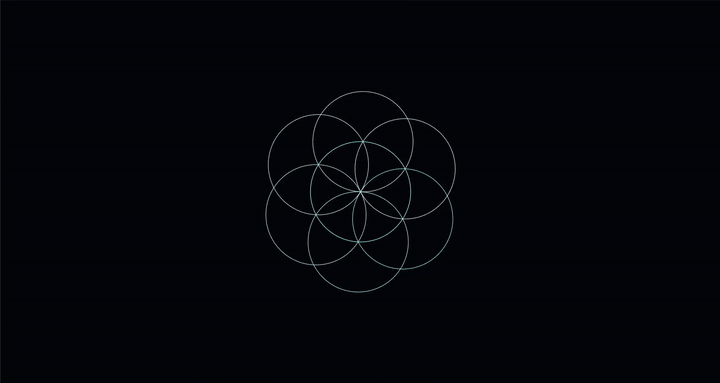
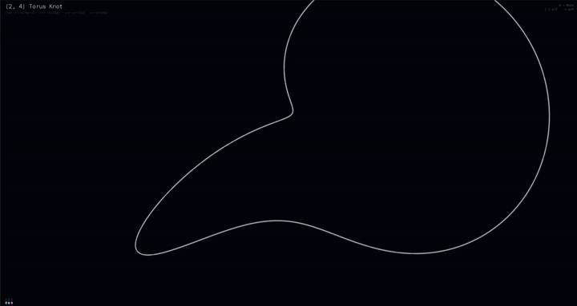
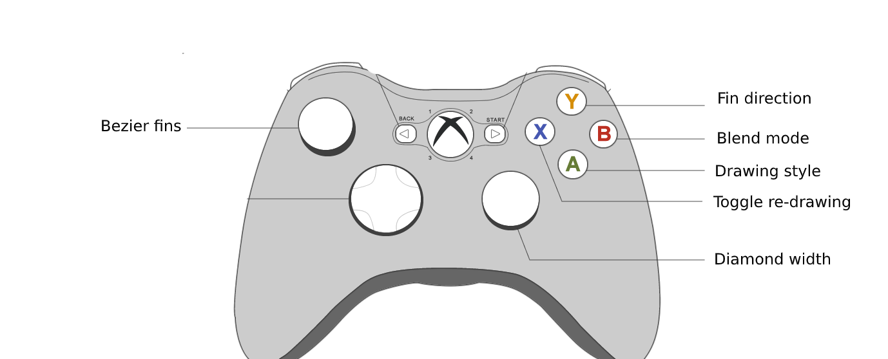

# Music Visualizer for a Friend

[](https://github.com/C-Kenny/music-visualizer-4-friend/actions/workflows/smoke-test.yml)
[](https://github.com/C-Kenny/music-visualizer-4-friend/tags)

Real-time audio-reactive music visualizer in [Processing 4](https://processing.org/). 50 scenes, FFT + beat detection + oscilloscope, GLSL post-processing, Xbox 360 / Xbox One controller (or your phone over WiFi) for live performance.

### Why

A friend of mine passed away — we used to play a lot of Halo together. This visualizer is dedicated to him, using his Halo 3 emblem as inspiration.


---

### Preview

Sample scenes (synthetic controller input + auto-played track — see `capture.sh`):

| | | |
|---|---|---|
| <br>Dot Mandala | <br>Maze Puzzle | <br>Table Tennis 3D |
| <br>Gravity Strings | <br>Recursive Fractal | <br>GPU Shader Lesson |
| <br>Worm Colony | <br>Recursive Mandala | <br>Sacred Geometry |
| <br>Torus Knot | <br>Merkaba | <br>Pentagonal Vortex |

> Many scenes are far more dynamic with live controller input — the previews above use a synthetic stick + beat-driven button driver, but a human at the pad changes colours, sweeps the kaleidoscope, drives the worm colony, etc.

Hand-recorded HD walkthroughs (with controller overlay): _coming back soon, see [issues](https://github.com/C-Kenny/music-visualizer-4-friend/issues)._

---

### Install

**Linux (.deb):** download from [Releases](https://github.com/C-Kenny/music-visualizer-4-friend/releases), then:

```bash
sudo dpkg -i music-visualizer_*.deb
music-visualizer
```

**From source (any OS):** see [Run from source](#run-from-source).

---

### Controls

#### Keyboard

| Key | Action |
|-----|--------|
| `1`–`9`, `0` | Jump to scene at that slot in `SCENE_ORDER` |
| `<` / `>` | Previous / next scene |
| `Tab` | Scene switcher overlay |
| `'` (apostrophe) | Audio source switcher (file vs live device) |
| `G` / `Shift+G` | Cycle PostFX stack / disable all (bloom, chroma, scanlines, vignette, pixel-sort) |
| `F9` / `Shift+F9` | Toggle auto-switcher / cycle mode |
| `F11` | Toggle fullscreen on current display |
| `Ctrl+1`..`Ctrl+9` | Move window to display N |
| `Esc` | **Kill switch** — emergency fade-to-black (re-press to restore) |
| `s` | Pause / resume song |
| `n` / `N` | Next / shuffle song |
| `o` | Open file picker |
| `m` | Toggle metadata HUD |
| `i` | Toggle controller-guide overlay |
| `` ` `` | Toggle code/formula overlay |
| `t` / `p` / `P` | Toggle tunnel / plasma / polar-plasma background |
| `+` / `-` | Nudge live-input gain (DEVICE mode only); `0` re-enables AGC |
| `←` / `→` | Skip ±10s | 
| `↑` / `↓` | Master gain ±5 |
| `c` | Calibrate controller stick centre |
| `q` | Quit |

#### Xbox controller



- **LB / RB** — previous / next scene
- **LB + Y** — cycle PostFX  ·  **LB + X** — disable PostFX
- **D-pad up/left/right** — toggle tunnel / plasma / polar-plasma background
- **Back** — stop song  ·  **Start** — start song  ·  **Back + Start** — kill switch (fade-to-black)
- **Sticks / triggers** — per-scene; press `i` for the in-sketch guide
- **L3** — toggle auto-switcher  ·  **R3** — cycle auto-switcher mode

#### Phone controller (WiFi)

The sketch starts an HTTP + WebSocket server on launch. Bottom-left badge shows a URL like `http://<lan-ip>:8080`. Open it on a phone on the same network for a touch controller. Pin / lockdown / kick controls are available via the admin panel.

---

### Run from source

Requires [Processing 4](https://processing.org/download) (CLI: `processing` or the `processing` snap).

```bash
git clone git@github.com:C-Kenny/music-visualizer-4-friend.git
cd music-visualizer-4-friend
./run.sh                 # opens file picker, select a song
./run.sh device          # start in live audio capture mode
./watch.sh               # hot-reload dev mode (restarts on .pde save)
```

Low-power machines:

```bash
./run.sh --args --lowpower
./run.sh --args --lowpower-scale=4
```

#### Dev overrides

All gitignored, all live in `Music_Visualizer_CK/`:

| File | Effect |
|------|--------|
| `.devmode` | Skip file picker, use random song from `~/Music` |
| `.devsong` | Override song path |
| `.devscene` | Start on a specific scene index (e.g. `echo 25 > .devscene`) |
| `.devdemo` | Run with synthetic controller input (Lissajous sweep + beat-driven button taps) — same as `MV_DEMO_MODE=1` |
| `.devpreview` | Save a frame to `/tmp/vis_preview.png` every 5s. **Do not leave on** — `saveFrame()` blocks the render thread |
| `.smoketest` | Run all 50 scenes for ~120 frames each, write `.smoketest_result`, exit |
| `.display` | Persisted display index + fullscreen flag (managed by `F11` / `Ctrl+1..9`) |
| `featureflags.json` | Per-machine flag overrides (HEADACHE_FREE_MODE, BLOOM_ENABLED, AUTO_SWITCH_MODE, etc.) |

#### Tests

```bash
./run-tests.sh           # Maven JUnit checks (requires mvn on PATH)
touch Music_Visualizer_CK/.smoketest && ./run.sh   # full scene sweep
```

#### Capturing preview gifs

```bash
./capture.sh                                            # all 12 default scenes
./capture.sh --only 17,19 --duration 20                 # subset, longer
./capture.sh --song /path/to/track.mp3
```

Needs `xdotool`, `ffmpeg`, `pactl`. Outputs `media/previews/scene_NN_*.{mp4,gif}`.

---

### Live-show readiness

Built-in features for performing in front of an audience:

- **Crash resilience** — scene exceptions are caught, logged to `crash_log.txt`, blacklisted after 3 failures, and auto-skipped (`SceneGuard`).
- **Emergency kill switch** — `Esc` (or controller Back+Start) fades to black in 0.3s for wardrobe / safety.
- **Display select + fullscreen** — `F11` and `Ctrl+1..9`; preference persists in `.display`.
- **Headache-free mode** — calmer palette / dimmer composite for long sets, toggleable via `featureflags.json` or the admin web UI.
- **Auto-switcher** — `F9` cycles scenes automatically (time-based or beat-aware modes).

Roadmap for full venue-ready deployment lives in [`documentation/production_readiness_for_live_shows.md`](documentation/production_readiness_for_live_shows.md): tap-tempo BPM lock, MIDI control, operator HUD, setlists, strobe-safety cap, recording, live mixer input.

---

### Libraries

Install via Processing's **Contribution Manager** (Sketch → Import Library → Manage Libraries):

| Library | Used for |
|---------|----------|
| [Minim](http://code.compartmental.net/tools/minim/) | Audio playback, FFT, beat detection, live device capture |
| [Game Control Plus v1.2.2](http://lagers.org.uk/gamecontrol/) | Xbox controller input |
| [Handy](https://github.com/gicentre/handy) | Hand-drawn line aesthetic |
| [PeasyCam](https://mrfeinberg.com/peasycam/) | 3D camera (Shapes3D scene) |
| [DashedLines](https://github.com/garciadelcastillo/dashed-lines) | Dashed line rendering |

---

### Credits

- [Luis Gonzalez](https://luis.net/) — Processing tunnels + plasma backgrounds
- ttaM — incredible help on Bezier curves (fins)

---

### Resources

- [Source on GitHub](https://github.com/C-Kenny/music-visualizer-4-friend)
- [Issue tracker](https://github.com/C-Kenny/music-visualizer-4-friend/issues)
- [Scene list + state numbers](documentation/scene_list.md)
- [Architecture notes](documentation/architecture.md)
- [Production-readiness roadmap](documentation/production_readiness_for_live_shows.md)
- [Processing coding standards](documentation/coding_standards_processing.md)
