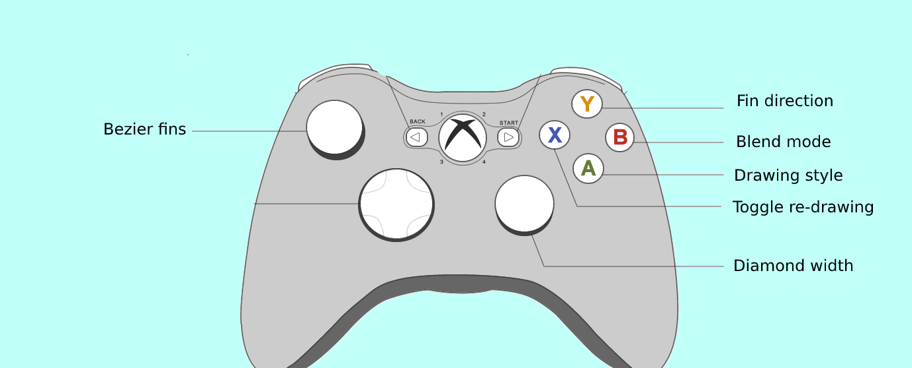

# Music Visualizer for a Friend

### What?
2D Music Visualizer, made using [Processing 3.](https://processing.org/)


### Current State?

With sound: [Music Visualizer with Controller Overlay](https://vimeo.com/501329047)


Without sound:


### Xbox 360 Controller Layout:



### How to run development build?

This visualizer relies on [processing-java](https://github.com/processing/processing/wiki/Command-Line) to be installed.

```
$ which processing-java
/usr/local/bin/processing-java
```

Once that has been setup, you can clone the repo:

`$ git clone git@github.com:C-Kenny/music-visualizer-4-friend.git`

then launch the visualizer with:

`$ ./run.sh`

### How to run Visualizer from Linux?

From a Linux file browser you can double click the launcher file located at:

`Music_Visualizer_CK/application.linux64/Music_Visualizer_CK`

### How to run Visualizer from Windows?

From Windows you can double click the `Music_Visualizer_CK.exe` from `Music_Visualizer_CK\application.windows64` folder

### Why?

One of my friends passed away, we used to play a lot of Halo together. This music visualizer is dedicated to him, and we use his Halo 3 Emblem as inspiration.


### Credits:

- [Luis Gonzalez for the amazing Processing tunnels + plasma. Used as toggle-able backgrounds](https://luis.net/)
- ttaM for the incredible help on the Bezier Curves (fins)!

### Required Libraries:

- [Handy. Used to make lines look 'hand-drawn'](https://github.com/gicentre/handy)
- [Game Control Plus. Used to handle Xbox 360 controller input](http://lagers.org.uk/gamecontrol/)
- [Minim. Used by the computer to listen to the music + break into frequencies/decibels](http://code.compartmental.net/tools/minim/)


### Resources:

- [Music Visualizer source code on GitHub](https://github.com/C-Kenny/music-visualizer-4-friend)
- [GitHub Issue tracker for repo](https://github.com/C-Kenny/music-visualizer-4-friend/issues)
